<!-- ═══════════════ HEADER ═══════════════ -->

 

  

  

🌎 <b> &nbsp;·&nbsp; 🇺🇸 English &nbsp;·&nbsp; 🇧🇷 Português

 

<!-- ═══════════════ SOBRE / ABOUT ═══════════════ -->
## 👨🏽‍💻 About me · Sobre mim

> *"Raw data is just the beginning. What matters is the decision it makes possible."*
>  *"Dados brutos são só o começo. O que importa é a decisão que eles permitem tomar."*

### 🇺🇸 English

Hi! I'm **Lucas da Silva Moutinho**, a student at **UFABC** (Federal University of ABC, Brazil) pursuing degrees in **Computer Science** and **Science & Technology**, and a **Data Science Intern at Itaú Unibanco**, working in the **Credit Recovery** area. I enjoy following a problem end to end: understanding the business pain, preparing the data, modeling, and delivering the result to the people who make the decisions. We work collaboratively, keeping constant dialogue with the policy and credit areas and with the teams that will use the models, so we stay aligned on solving the right problem. I'm now looking to grow from intern to **Junior Data Scientist**.

### 🇧🇷 Português

Sou **Lucas da Silva Moutinho**, estudante da **UFABC** e estagiário de **Ciência de Dados no Itaú**, onde trabalho na área de **Recuperação de Crédito**. Gosto de acompanhar um problema de ponta a ponta: entender a dor do negócio, preparar os dados, modelar e levar o resultado até quem toma a decisão. Trabalhamos de forma colaborativa, mantendo um diálogo constante com as áreas de políticas, crédito e os times que utilizarão os modelos, garantindo que estejamos sempre alinhados com a resolução assertiva dos problemas. Busco evoluir para **Cientista de Dados Júnior**.

<table>
  <tr>
    <td width="50%" valign="top">
      <h4>🎓 Education · Formação</h4>
      B.Sc. Computer Science &amp; Science and Technology 
      Ciências da Computação · Ciências &amp; Tecnologia 
      <b>Universidade Federal do ABC (UFABC), Brazil</b>
    </td>
    <td width="50%" valign="top">
      <h4>💼 Current role · Atuação</h4>
      Data Science Intern, Credit Recovery 
      Estágio em Ciência de Dados · Recuperação de Crédito 
      <b>Itaú Unibanco</b>
    </td>
  </tr>
  <tr>
    <td width="50%" valign="top">
      <h4>🔭 Focus · Foco</h4>
      Machine Learning, predictive modeling, applied statistics and data analysis 
      Machine Learning, modelagem preditiva, estatística aplicada e análise de dados
    </td>
    <td width="50%" valign="top">
      <h4>🎯 Next step · Próximo passo</h4>
      Grow into a <b>Junior Data Scientist</b> role, with more scope and ownership 
      Evoluir para <b>Cientista de Dados Júnior</b>, com escopos maiores e mais autonomia
    </td>
  </tr>
</table>

 

<!-- ═══════════════ STACK ═══════════════ -->
## 🛠️ Tech Stack · Stack Tecnológica

 

<!-- ═══════════════ EXPERIÊNCIA ═══════════════ -->
## 💼 Experience · Experiência

<table>
  <tr>
    <td width="170" align="center">
        
      <b>Itaú Unibanco</b> 
      Data Science Intern 
      Credit Recovery
    </td>
    <td>
      <b>🇺🇸 English</b>
      <ul>
        <li>🤖 Developing and applying <b>Machine Learning</b> models for credit recovery</li>
        <li>🗄️ Handling <b>large-scale datasets</b> and building analytics pipelines</li>
        <li>⚙️ Optimizing analytical processes and supporting <b>data-driven strategic decisions</b></li>
      </ul>
      <b>🇧🇷 Português</b>
      <ul>
        <li>🤖 Desenvolvimento e aplicação de modelos de <b>Machine Learning</b> voltados à recuperação de crédito</li>
        <li>🗄️ Manipulação de <b>grandes volumes de dados</b> e construção de pipelines de análise</li>
        <li>⚙️ Otimização de processos analíticos e suporte à <b>tomada de decisão estratégica</b> baseada em dados</li>
      </ul>
    </td>
  </tr>
</table>

 

<!-- ═══════════════ CERTIFICAÇÕES ═══════════════ -->
## 🏆 Certifications & Badges · Certificações

<table>
  <tr>
    <td align="center" width="190">
       
      <b>Associate</b> Data Science
    </td>
    <td align="center" width="190">
       
      <b>Associate</b> Data Modelling
    </td>
    <td align="center" width="190">
       
      <b>Practitioner</b> D&amp;A Foundation
    </td>
    <td align="center" width="190">
       
      <b>Trained</b> Credit · Crédito
    </td>
    <td align="center" width="190">
       
      <b>Trained</b> Recovery · Recuperação
    </td>
  </tr>
</table>

🔗 Digital badges issued by <b>Itaú Unibanco</b>, verifiable on <a href="https://www.credly.com/users/lucas-moutinho">Credly</a> — click each one to validate. Badges digitais emitidos pelo <b>Itaú Unibanco</b> e verificáveis na Credly — clique para validar.

 

<!-- ═══════════════ ESTATÍSTICAS ═══════════════ -->
## 📊 GitHub Stats

 

<!-- ═══════════════ CONECTAR ═══════════════ -->
## 📫 Let's Connect · Vamos Conectar?

🇺🇸 I'm open to conversations about **Junior Data Science roles**, ideas on ML applied to credit, and collaboration on data projects.

🇧🇷 Estou aberto a conversas sobre **oportunidades Júnior em Data Science**, troca de ideias sobre ML aplicado a crédito e colaborações em projetos de dados.

 

  

